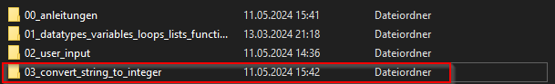
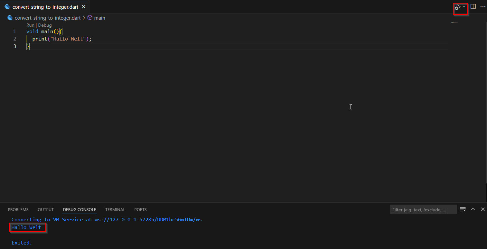

# Code Ausführen - CMD/VSCode

* Ordner anlegen.

  

* File mit Namen und `.dart` eingeben.

  

* Den erstellten Ordner mit Drag & Drop in VSCode reinziehen.

* Folgenden Code in das `convert_string_to_integer.dart` File eingebn:

  ```dart
  void main(){
    print("Hallo Welt");
  }
  ```

* Code Ausführen:

  * VSCode: 

    

  * CMD: Pfad wo das Dart-File liegt im CMD öffnen und anschließend `dart <filename>` eingeben und Enter.

    